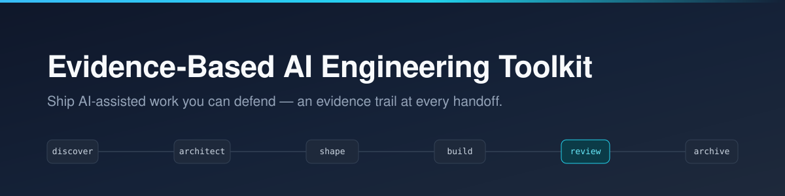
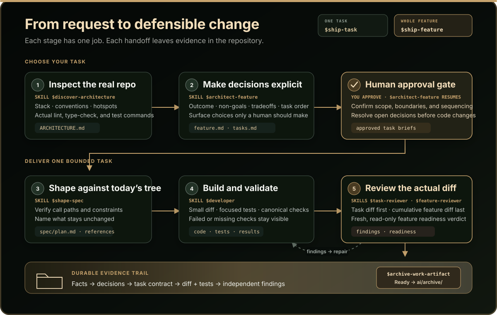

<p align="center">
  
</p>

<p align="center">
  <strong>A delivery system for AI-assisted engineering that leaves an evidence trail you can defend — in code review, in a client meeting, or six months later.</strong>
</p>

<p align="center">
  
  
  
  
</p>

---

We all know AI/LLMs can make an already capable engineer faster. It can also make a less experienced engineer confidently wrong — faster. The problem only magnifies when work starts from incomplete context, vague requirements, or an unfamiliar codebase.

This toolkit gives AI-assisted delivery a durable operating model: **inspect the real system, make the
decision trail explicit, shape a narrow plan, validate the result, and review it independently before
calling it done.**

<p align="center">
  
</p>

Every arrow in the diagram is a handoff backed by files in the repository. The conversation can end;
the next stage still has the evidence it needs.

## See it in 60 seconds

Install the toolkit, then try it from the root of a repository you want to understand or change.
The dry run is read-only; the final command creates links for both Codex and Claude Code.

```bash
git clone https://github.com/kalwalkden/evidence-based-ai-engineering.git
cd evidence-based-ai-engineering
./sync-installable-skills.sh --dry-run
./sync-installable-skills.sh
```

Start a new Codex or Claude Code session in your target repository so it discovers the installed
skills. Then send these prompts in order. They are agent prompts, not shell commands.

**1. Map the repository before asking for a change.**

```text
Use discover-architecture on this repository.
```

Discovery does not change application code. It writes two documentation updates:
`ARCHITECTURE.md` records the stack, conventions, hotspots, and real validation commands; a managed
block in `AGENTS.md` makes those commands available to later stages.

**2. Turn an outcome into a reviewable feature plan.** Be specific about behavior that must not
change.

```text
Use architect-feature to plan per-organization rate limiting. Keep existing per-user limits and the
public API unchanged.
```

The architect writes `ai/features/<feature-slug>/feature.md` and `tasks.md`, then stops before task
briefs are final. Read the proposed scope, non-goals, tradeoffs, and task order. Answer any open
questions. When it matches your intent, say:

```text
I approve the feature plan. Create the task briefs.
```

**3. Choose how much to ship.** Use the exact feature path reported by the architect.

```text
Ship the next task for ai/features/<feature-slug>.
```

That shapes, implements, tests, and reviews one bounded task, then stops. To run every remaining
task, the independent feature review, and archival in one workflow, use:

```text
Ship the feature at ai/features/<feature-slug>.
```

## Three problems it solves

**1. The agent begins from a plausible guess instead of the repository in front of it.** Framework
conventions, test commands, and likely call paths are verified before planning. Discovery records
what it found in `ARCHITECTURE.md`; task shaping checks the current tree again immediately before
implementation. A familiar-looking codebase is never treated as proof of how this one works.

**2. The change drifts beyond the request, then the same agent declares it done.** Feature approval
locks the intended outcome, non-goals, and task order before code changes. Each task gets a focused
spec that names its boundaries. Validation uses the repository's actual commands, and the final
feature review reads the cumulative diff in a fresh, read-only context. Missing checks remain
missing; they are not translated into success.

**3. The reasoning disappears with the chat.** Plans, rejected alternatives, task contracts, and
references live under `ai/` beside the code; whole-feature runs also keep their validation and review
record there. Completed work moves to `ai/archive/` instead of being discarded. A reviewer today, a
client next month, or an engineer six months later can reconstruct both what changed and why.

## Why it is designed this way

The workflow separates kinds of reasoning that create different failure modes when collapsed into
one long agent session:

- **Discovery establishes facts.** Planning starts from observed code, configuration, and tests, not
  a model's memory of a similar stack.
- **Architecture records decisions.** Humans approve product scope, tradeoffs, and meaningful
  boundaries; agents resolve facts that can be checked in the repository.
- **Shaping happens just in time.** A feature plan stays stable while the next task's implementation
  map is refreshed against the tree as it exists now, after earlier tasks have landed.
- **Implementation stays bounded.** One written task contract produces one attributable diff, tests,
  and validation record.
- **Review remains independent.** A read-only reviewer in a fresh context judges the actual change
  without inheriting the implementer's assumptions or quietly repairing what it is judging.
- **Artifacts outlive sessions.** The repository, not conversation history, is the system of record
  for decisions and evidence.

This costs more time and model calls than an ad-hoc prompt. That is intentional for work where
scope, correctness, and the ability to explain the result matter; it is unnecessary ceremony for a
typo. See [Design principles](docs/design-principles.md) for the full reasoning behind progressive
commitment, review boundaries, model routing, parallel investigation, and the artifact lifecycle.

## Installation details

The commands in [See it in 60 seconds](#see-it-in-60-seconds) create symlinks in
`~/.codex/skills` and `~/.claude/skills`; they do not copy or move the toolkit. Keep the cloned
repository in place after installation. Pull future updates there, then run the installer again to
add, repair, or retire the links managed by this checkout.

The installer only manages its own links. It records what it installed, removes only those links when
a skill is later dropped from the list, and never touches real files, real directories, or symlinks
belonging to another project — if another project already owns a skill name, it skips that name with a
warning instead of taking it over. See [Installer safety](#installer-safety).

## Choose your workflow

Pick the smallest one that fits.

### Discovery only — unfamiliar codebase, no code changes yet

Read-only: Produces an architecture report or a traced end-to-end path. Use before estimating,
onboarding, or inheriting a system.

| Skill | Produces |
| --- | --- |
| `discover-architecture` | Stack, conventions, classified hotspots, and canonical validation commands |
| `trace-domain-flow` | One representative end-to-end path, documented under `docs/` and cross-linked |

### One task — a fix or a small change

Skip feature planning. Shape a spec and implement against it. Then, review the exact diff.

Run the three skills yourself, stopping between each:

| Skill | Role |
| --- | --- |
| `shape-spec` | Expands a brief into a task-level `spec/` package grounded in current repo evidence |
| `developer` | Implements one task, adds high-ROI tests, validates before reporting |
| `task-reviewer` | Spec-aware, read-only review of the resolved diff before merge |

**OR** hand the whole task to one skill:

| Skill | Role |
| --- | --- |
| `ship-task` | Runs shape + developer for exactly one task, then **stops** |

### A whole feature — multi-step work

Plan it, break it into reviewable tasks, then run to completion with an independent readiness gate.

| Skill | Role |
| --- | --- |
| `architect-feature` | Feature plan, visual design, `tasks.md`, and task briefs — pauses for approval |
| `ship-feature` | Runs every remaining task, then up to three independent reviews |

```text
discover-architecture → architect-feature → shape-spec → developer → task-reviewer
                        ↓       OR       ↓
                    ship-feature      ship-task (repeat until tasks are done)
```

## How this compares

| | Ad-hoc prompting | `AGENTS.md` / `CLAUDE.md` conventions | Heavyweight process (RFCs, gated boards) | **This toolkit** |
| --- | --- | --- | --- | --- |
| Setup cost | None | Low | High | Low — clone and symlink |
| Scales past one session | ✗ | Partial — conventions persist, decisions don't | ✓ | ✓ — artifacts live in the repo |
| Scope is written down before code | ✗ | ✗ | ✓ | ✓ — spec names what stays unchanged |
| Independent verification | ✗ | ✗ | ✓ — human reviewers | ✓ — separate context, ideally another model |
| Validation recorded as evidence | ✗ | ✗ | ✓ | ✓ |
| Overhead on a one-line fix | None | None | Severe | Moderate — skip to `ship-feature`\ `ship-task`, or don't use it |
| Enforced by tooling | ✗ | ✗ | ✓ — CI/approvals | ✗ — conventions, not gates |

### Honest tradeoffs

Worth knowing before you adopt it:

- **It costs more per change.** Discovery, specs, and an independent review mean more model calls and
  more wall-clock time. On a typo fix that overhead is pure waste, just edit the file yourself.
- **It is opinionated about layout.** Feature artifacts live under `ai/features/`, archives under
  `ai/archive/`. If that conflicts with your repo conventions, you can change the skills to fit your workflow.
- **Nothing is enforced.** These are agent instructions, not CI gates. An agent can ignore them and
  nothing here blocks a merge. Treat it as a strong default, not a control.
- **The review is a second opinion not a proof.** An independent adversarial pass on the real diff
  catches meaningfully more than self-review. It still misses things and a "Ready" verdict is not a
  guarantee of correctness.
- **It adds files to your repo.** Some teams want the decision trail in the repository; others will
  find `ai/` noisy. If you want plans in Linear or Notion instead you can modify the skills do that, but it is going to be a bit fussy.
- **Best results need model diversity.** The strongest guarantee is review by a different capable model.

## Installer safety

`sync-installable-skills.sh` links every skill named in `installable-skills.txt` into `~/.codex/skills`
and `~/.claude/skills`. It manages symlinks only that it owns:

- **It records what it installed** in a manifest under `${XDG_STATE_HOME:-~/.local/state}/`, keyed by
  repository path. The two checkouts never clobber each other's record.
- **It never takes over a name another project owns.** A link pointing elsewhere is skipped with a
  warning naming the owner not repointed.
- **It removes only its own retired links** and deleted only when this kit installed it.
- **It never touches real files or directories.** It only touches symlinks.
- **`--dry-run` writes nothing**.

## Compatibility

| | |
| --- | --- |
| **Runtimes** | OpenAI Codex (`agents/openai.yaml`) and Claude Code (`SKILL.md`) |
| **OS** | macOS and Linux |
| **Shell** | `bash` 3.2+ — the installer avoids bash 4 features, so stock macOS `/bin/bash` works |
| **Python** | 3.9+, and only for `archive-work-artifact`; the rest is prompt-level guidance |
| **Windows** | Not tested. The installer relies on POSIX symlinks |

Skills are plain Markdown with a small YAML block on top. Adapting the language, commands, and
quality gates to your team's practice is expected.

## Contributing

Contributions that improve evidence quality, clarity, safety, validation, and developer experience are
welcome! Keep additions focused, explain the problem they solve, and preserve the core idea: AI/LLM
assistance should make engineering work more understandable and trustworthy.

If you are changing the installer run the dry-run against a scratch `HOME` before opening a PR.

Contributions are accepted under the project's license, per Apache-2.0 section 5.

## Support

Questions, bug reports, and workflow experience reports go to [issues](../../issues). Adoption reports
are genuinely useful - especially the ones where the toolkit got in the way.

## License

Licensed under the Apache License, Version 2.0 — see [LICENSE](LICENSE).

Copyright 2026 Kal Walkden.

Apache-2.0 permits commercial and private use, modification, and redistribution, provided the license
and copyright notice are retained and changed files are marked. It also includes an express patent
grant from contributors.

## Created by

**Kal Walkden**, Fractional CTO. I build and lead engineering teams. This toolkit is the operating
model I use so AI-assisted delivery stays explainable to the people who have to trust it:
clients, boards, and the engineers who inherit the code.

[wtwentyseven.com](https://www.wtwentyseven.com)
